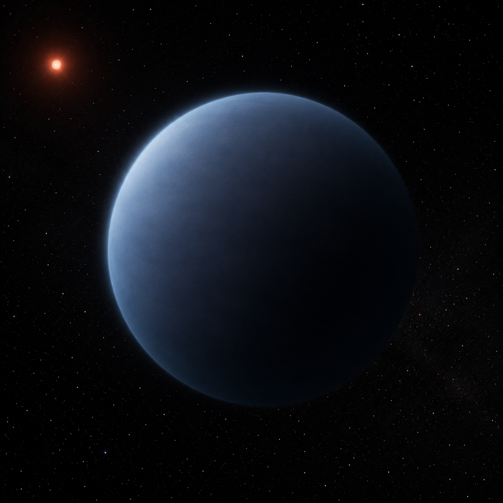

# K2-18 b — Exoplanet Atmosphere Report



*AI-generated artist's concept — not a real photograph. See the report for actual JWST data.*

The most contested atmosphere in exoplanet science right now: a temperate
sub-Neptune with a disputed CO2/CH4 detection, a tentative and unconfirmed
DMS signal, and a live debate about whether combining data from different
JWST instruments manufactures the very feature it claims to find. This repo
runs a simple band-vs-continuum test against an offset-corrected combined
spectrum and is explicit about what that test can and can't establish.

**[Open the full report](index.html)** (open locally in a browser, or serve
with `python -m http.server` from this directory).

## Data sources

- **System parameters** — from the NASA Exoplanet Archive TAP
  service (`pscomppars` table).
- **Combined JWST spectrum** — 4411 native-resolution wavelength points
  spanning NIRISS SOSS, NIRSpec G395H, and MIRI LRS, with the source paper's
  own best-fit inter-instrument offset already applied, from a 2025
  reanalysis investigating whether aerosols/offsets can reconcile the
  MIRI and NIRISS/NIRSpec observations. Released publicly on Zenodo
  ([10.5281/zenodo.16277833](https://doi.org/10.5281/zenodo.16277833)).
- **Analysis** — `scripts/analyze_spectrum.py` bins the native spectrum for
  display and compares the mean depth in the CO2 absorption band
  (4.1-4.6 micron) against a nearby continuum window. Run it yourself:

  ```bash
  pip install -r requirements.txt
  python scripts/analyze_spectrum.py
  ```

## Repository structure

```text
index.html              the report webpage
data/                    combined JWST spectrum file (Zenodo)
scripts/analyze_spectrum.py   binning + CO2-band-vs-continuum comparison
figures/                 generated plot + summary_statistics.csv
tests/                   unit tests + a regression check against the real data
```

## Tests

`tests/test_analysis.py` checks the weighted-mean and binning
functions against hand-computed cases and reruns the full pipeline on
the real downloaded spectrum, verifying it still reproduces the
numbers this README documents. Runs automatically on every push via
GitHub Actions; run locally with:

```bash
pytest tests/ -v
```

## What the numbers show, and what they don't

Using this offset-corrected combined spectrum, the CO2-band mean depth
exceeds the nearby continuum by only ~4 ppm, at ~0.2σ — statistically
indistinguishable from noise, and far from the confident detection the
original 2023 analysis reported using NIRISS+NIRSpec alone, before this
MIRI cross-check was available. That's a useful, quick diagnostic, not
a final answer: a two-window comparison isn't a molecular retrieval,
and the 0.2σ figure treats the underlying native-resolution points as
independent, when spectral extraction can introduce real correlation
between neighbors that this simple calculation ignores — depending on
the sign and structure of that correlation, accounting for it could
either widen or narrow the true uncertainty, not necessarily widen it.
Independent retrieval-based work points the same direction, though —
Schmidt et al. (2025) ran a
full retrieval across many combinations of the data and confirmed
methane at 4σ while finding no significant evidence for CO2 or DMS in
almost every combination tested.

## Limitations

This repo's band-vs-continuum statistic and a proper atmospheric
retrieval are different tools measuring different things; agreement
between this page's 0.2σ and Schmidt et al.'s more rigorous null result
is a useful cross-check, not proof that either is definitive on its
own. See the callout in [index.html](index.html) for the full version
of this caveat.

## References

1. Madhusudhan, N. et al., 2023. Carbon-bearing Molecules in a Possible
   Hycean Atmosphere. *The Astrophysical Journal Letters*, 956, L13.
2. Madhusudhan, N. et al., 2023. Potential Biosignature Detection: Possible
   Indications of Dimethyl Sulfide in the Atmosphere of K2-18 b. *The
   Astrophysical Journal Letters*, 963, L6.
3. Zenodo record
   [10.5281/zenodo.16277833](https://doi.org/10.5281/zenodo.16277833),
   "Investigating aerosols as a way to reconcile K2-18 b JWST MIRI and
   NIRISS/NIRSpec observations."
4. Wogan, N. et al., 2024. JWST Reveals CH4, CO2, and H2O in a Metal-rich
   Miscible Atmosphere on a Two-Column Sub-Neptune. *The Astrophysical
   Journal Letters*, 963, L7.
5. Schmidt, S.J. et al., 2025. Unraveling the non-equilibrium chemistry of
   the temperate sub-Neptune K2-18 b. *Astronomy & Astrophysics*
   (arXiv:2507.14983).
6. NASA Exoplanet Archive, <https://exoplanetarchive.ipac.caltech.edu/>.

## Author

Biswajit Jana — [Portfolio](https://biswajit1999.github.io/Biswajit_Jana.github.io/) · [GitHub](https://github.com/Biswajit1999) · [LinkedIn](https://www.linkedin.com/in/biswajit-jana-27011a151/) · [ORCID](https://orcid.org/0009-0002-2411-1891)
