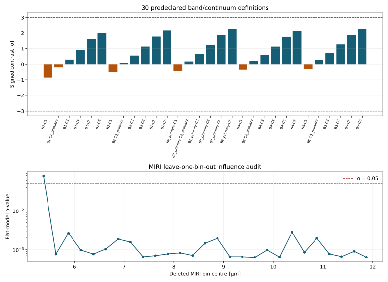

# K2-18 b — spectral robustness report

**Independent research report by [Biswajit Jana](https://biswajit1999.github.io/Biswajit_Jana.github.io/)** · [Live report](https://biswajit1999.github.io/k2-18b-exoplanet-report/) · [ORCID](https://orcid.org/0009-0002-2411-1891)

This repository asks a deliberately narrower question than an atmospheric
retrieval: **is a descriptive 4.3 µm band contrast robust to reasonable window
choices, and is apparent MIRI non-flatness robust to any one published bin?**

The answer is negative in both senses. Across 30 predeclared band/continuum
definitions, the signed contrast ranges from **−0.861σ to +2.258σ**; all remain
below the declared |3σ| threshold, but the sign and headline value are
definition-sensitive. A constant-depth model on 27 non-overlap MIRI bins gives
χ²=54.162 for 26 dof (p=0.000968), yet removing the influential 5.375 µm bin
raises p to 0.07832. Therefore the flatness rejection fails the predeclared
leave-one-bin-out rule.

Neither result is a molecular detection or exclusion. The analysis has no
retrieval, opacity model, full covariance matrix, cloud/haze physics, or
detector-level re-reduction.



## Critical provenance correction

The historical local filename
`data/k218b_niriss_nirspec_miri_combined_spectrum.txt` is retained for stable
links, but its 4,411 points end at 5.174 µm and contain **NIRISS SOSS + NIRSpec
G395H only**. Earlier versions incorrectly described this file as including
MIRI. The actual 28-bin MIRI LRS product is now committed separately as
`data/k218b_miri_lrs_eureka_spectrum.txt`.

Both arrays are numerically identical to named members of `Spectra.zip` in
[Zenodo record 10.5281/zenodo.16277833](https://doi.org/10.5281/zenodo.16277833).
The archive MD5, member names, column definitions, and canonical-LF SHA-256
digests are recorded in [`data/SOURCE.md`](data/SOURCE.md).

## Study design

The frozen protocol is [`configs/sensitivity_audit_v1.json`](configs/sensitivity_audit_v1.json).
It crosses five 4.3 µm band definitions with six blue/red continuum definitions
and declares |3σ| before evaluation. The MIRI test fits a constant to the 27 bins
beyond the NIRSpec endpoint and repeats the fit after deleting each bin. The
source paper's +160 ppm MIRI shift is used only in the joint display and cancels
from this within-instrument statistic.

Generated evidence:

- [`results/result_summary.json`](results/result_summary.json) — machine-readable headline and provenance;
- [`results/evidence_manifest.json`](results/evidence_manifest.json) — canonical hashes for every generated product;
- [`results/band_contrast_multiverse.csv`](results/band_contrast_multiverse.csv) — all 30 choices, not only the most convenient one;
- [`results/miri_flatness_leave_one_out.csv`](results/miri_flatness_leave_one_out.csv) — all 27 influence refits;
- [`figures/k218b_spectrum_audit.svg`](figures/k218b_spectrum_audit.svg) — corrected three-instrument coverage;
- [`research/research-maturity-before-after.svg`](research/research-maturity-before-after.svg) — repository-practice comparison, **45/100 → 96/100**.

The maturity number is an expert repository-practice rubric, not peer review, a
scientific-merit score, or a literal multiplier of truth.

## Reproduce

```bash
python -m pip install -r requirements.txt
python scripts/analyze_spectrum.py
python -m pytest -q
python -m ruff check scripts tests
git diff --exit-code
```

The generated products are deterministic across Windows/Linux line endings.
See [`docs/REPRODUCIBILITY.md`](docs/REPRODUCIBILITY.md) for the provenance
replay and [`docs/METHODS.md`](docs/METHODS.md) for equations and decision rules.

## Research record

- [`docs/CLAIMS.md`](docs/CLAIMS.md) — claim-by-claim evidence and superseded statements;
- [`docs/LIMITATIONS.md`](docs/LIMITATIONS.md) — what this analysis cannot establish;
- [`docs/BASELINE_AUDIT.md`](docs/BASELINE_AUDIT.md) — defects found before the upgrade;
- [`research/research-quality-rubric.json`](research/research-quality-rubric.json) — comparison score inputs.

## Literature context

The source deposit accompanies Jaziri & Drant (2025), arXiv:2509.13932. The
independent NIRISS+NIRSpec reanalysis by Schmidt et al. is arXiv:2501.18477;
earlier repository text incorrectly paired Schmidt et al. with arXiv:2507.14983,
which is Jaziri et al.'s non-equilibrium-chemistry study. Luque et al.
(arXiv:2505.13407) report insufficient joint-spectrum evidence for DMS/DMDS.
These studies use retrievals and alternative reductions that are more capable
than the descriptive checks here.

## Author and license

Biswajit Jana · [Portfolio](https://biswajit1999.github.io/Biswajit_Jana.github.io/) · [GitHub](https://github.com/Biswajit1999) · [ORCID](https://orcid.org/0009-0002-2411-1891)

MIT License. Upstream spectrum attribution remains with the cited Zenodo record
and source authors.
